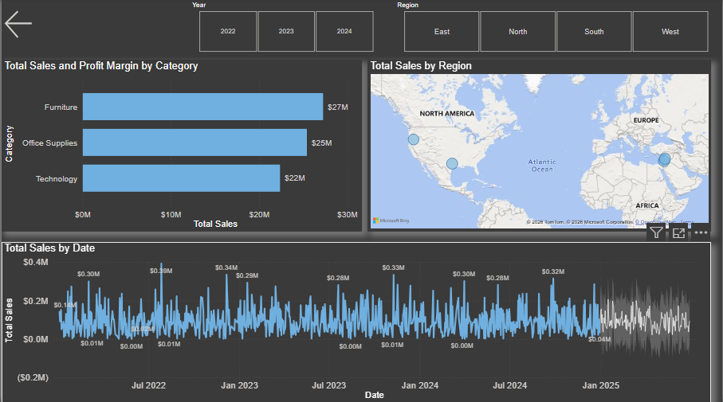

# 📊 Retail Sales Performance & Predictive Analytics Dashboard

## Overview

An interactive **Power BI** dashboard built to analyze retail sales
performance, profitability, and predictive trends. The dashboard helps
stakeholders monitor KPIs, compare historical performance, and identify
opportunities for business growth.

## Key Features

-   📈 Executive KPI cards (Sales, Profit, Profit Margin, Quantity)
-   🌍 Region-wise sales analysis
-   📅 Year and Region slicers
-   📊 Category & Sub-Category performance
-   🗺️ Geographic sales visualization
-   📉 Monthly sales trend analysis
-   🔮 Predictive forecasting for future sales

## Tools & Technologies

-   Power BI
-   Power Query
-   DAX
-   Data Modeling
-   Data Visualization

## Dashboard Preview

### 1. Executive Dashboard

### 2. Regional & Forecast Analysis

.png)

### 3. Product Performance

.png)

### 4. Sub-Category Profit Analysis

.png)

## Business Insights

-   Monitored overall sales, profit, and profit margin through
    interactive KPIs.
-   Compared monthly sales against previous periods to identify trends.
-   Analyzed sales by category, sub-category, and region.
-   Used map visuals to identify geographic sales distribution.
-   Included forecasting to support data-driven planning.

## Resume Highlights

-   Built an interactive Power BI dashboard with multiple report pages.
-   Created DAX measures for Sales, Profit, Quantity, and Profit Margin.
-   Cleaned and transformed raw data using Power Query.
-   Designed an executive dashboard using KPIs, slicers, maps, and trend
    charts.
-   Enabled interactive drill-down analysis for business
    decision-making.

## Author

**Abhinav Gusain**
